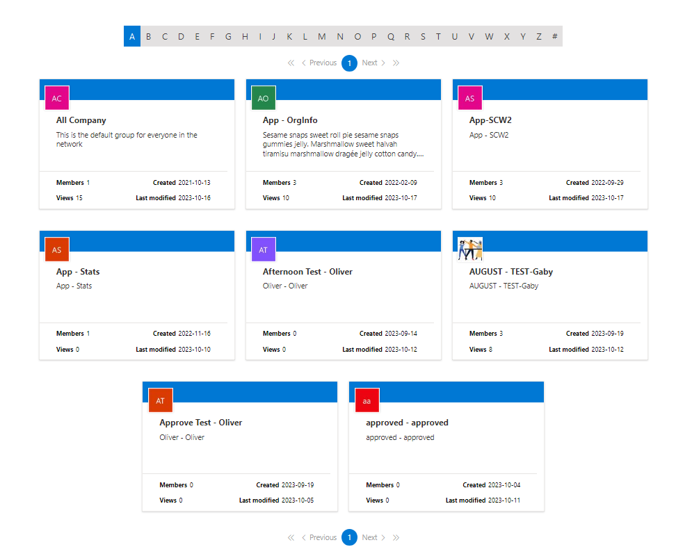
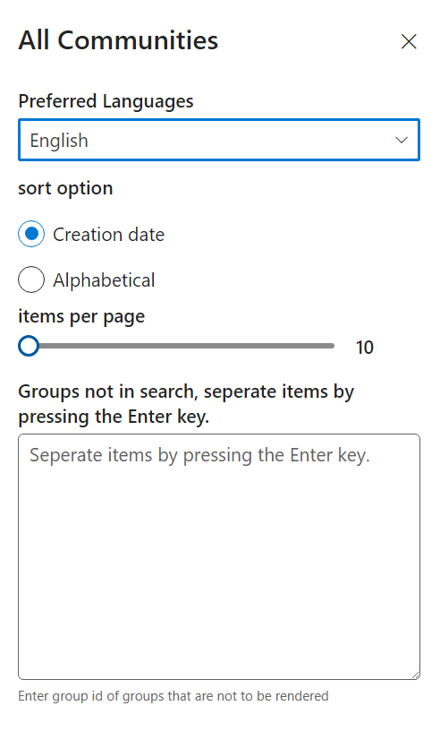

# All communities

## Summary

- This webpart generates all of the Office 365 groups that have been created in the SharePoint site
- Option to show all groups based on the selected letter or # (numbers)
- Able to choose how many groups to display in the property pane
- Ability to sort cards alphabetically or date the group was created
- Able to change the language (English/French) in the property pane
- Able to hide any group by entering the group id in the property pane

### webpart

### property pane:

## Prerequisites
None.

## API permission
Microsoft Graph - User.ReadBasic.All

## Version 

## Applies to

- [SharePoint Framework](https://aka.ms/spfx)
- [Microsoft 365 tenant](https://docs.microsoft.com/en-us/sharepoint/dev/spfx/set-up-your-developer-tenant)

> Get your own free development tenant by subscribing to [Microsoft 365 developer program](http://aka.ms/o365devprogram)

## Version history

Version|Date|Comments
-------|----|--------
1.0|September 13, 2019|Initial release
1.1|June 1, 2020| Upgraded to SPFX 1.10.0
1.2|July 8, 2020| Added Grid Layout
1.3|October 18, 2023| Upgraded to SPFX 1.17.4

## Minimal Path to Awesome

- Clone this repository
- Ensure that you are at the solution folder
- In the command-line run:
  - **npm install**
- To debug in the front end:
  - go to the `serve.json` file and update `initialPage` to `https://domain-name.sharepoint.com/_layouts/15/workbench.aspx`
  - In the command-line run:
    - **npm install**
- To deploy:
  - in the command-line run
    - **gulp clean**
    - **gulp bundle --ship**
    - **gulp package-solution --ship**
- Add the webpart to your tenant app store
- Approve the web API permissions
- Add the Webpart to a page
- Modify the property pane according to your requirements
## Disclaimer

**THIS CODE IS PROVIDED *AS IS* WITHOUT WARRANTY OF ANY KIND, EITHER EXPRESS OR IMPLIED, INCLUDING ANY IMPLIED WARRANTIES OF FITNESS FOR A PARTICULAR PURPOSE, MERCHANTABILITY, OR NON-INFRINGEMENT.**